# Real-Time Data Platform

**Live streaming data pipeline processing events through Kafka, dbt, and automated analytics**

🔴 [View Live Dashboard](your-cloudflare-url-here) | 📊 [Architecture Diagram](#architecture) | 💻 [Source Code](https://github.com/yourusername/data-platform-demo)

---

## Overview

A production-grade streaming data platform demonstrating end-to-end data engineering:
- **Ingests** 1000+ events/minute through Apache Kafka
- **Processes** streaming data in real-time with Python consumers
- **Transforms** raw data using dbt, orchestrated by Airflow (automated every 60 seconds)
- **Analyzes** across data sources using Trino's distributed SQL engine
- **Visualizes** live metrics in Apache Superset dashboards

**Tech Stack:** Apache Kafka • PostgreSQL • Apache Airflow • dbt • Trino • Apache Superset • Python • Docker

---

## Architecture

```mermaid
graph LR
    A[Kafka Producer<br/>Python] --> B[Kafka<br/>Topic]
    B --> C[Consumer<br/>Python]
    C --> D[PostgreSQL<br/>Raw Data]
    D --> E[Airflow<br/>Every 1 min]
    E --> F[dbt Models<br/>Transforming]
    F --> G[PostgreSQL<br/>Analytics DB]
    G --> H[Trino<br/>Querying]
    H --> I[Superset<br/>Dashboard]
    
    style A fill:#4CAF50
    style B fill:#FF9800
    style C fill:#4CAF50
    style D fill:#2196F3
    style E fill:#9C27B0
    style F fill:#00BCD4
    style G fill:#2196F3
    style H fill:#FF5722
    style I fill:#673AB7
```

**Data Flow:**
1. Python producer generates synthetic user events → Kafka topic
2. Stream consumer aggregates events in real-time → PostgreSQL raw tables
3. Airflow triggers dbt transformations every 60 seconds
4. dbt creates analytics-ready tables from raw streaming data
5. Superset queries via Trino for high-performance analytics
6. Dashboard auto-refreshes to show near real-time data

---

## Key Features

**Real-time processing** - Events appear in dashboard within 60 seconds  
**Automated orchestration** - Airflow manages dbt transformations on schedule  
**Separation of compute/storage** - Trino queries data without ETL  
**Production patterns** - UPSERT logic, idempotent writes, error handling  
**Scalable architecture** - Horizontally scalable Kafka consumers

---

## What The Platform Tracks

The system processes user behavior events:

- **Clicks** - User interactions with UI elements
- **Views** - Page/content impressions  
- **Purchases** - Conversion events

**Dashboard Visualizations:**
- Top users by total activity
- Event type distribution (pie chart)
- Purchase conversion rates by user
- Real-time event timeline
- User engagement metrics

---

## Technical Highlights

### Stream Processing
\`\`\`python
# Real-time aggregation with idempotent UPSERT
cur.execute("""
    INSERT INTO streaming.user_events (user_id, event_type, event_count)
    VALUES (%s, %s, 1)
    ON CONFLICT (user_id, event_type)
    DO UPDATE SET event_count = streaming.user_events.event_count + 1
""", (user_id, event_type))
conn.commit()
\`\`\`

### dbt Transformations
\`\`\`sql
-- models/analytics/user_event_summary.sql
{{ config(materialized='table') }}

SELECT 
    user_id,
    SUM(CASE WHEN event_type = 'click' THEN event_count ELSE 0 END) as total_clicks,
    SUM(CASE WHEN event_type = 'view' THEN event_count ELSE 0 END) as total_views,
    SUM(CASE WHEN event_type = 'purchase' THEN event_count ELSE 0 END) as total_purchases,
    SUM(event_count) as total_events
FROM {{ source('streaming', 'user_events') }}
GROUP BY user_id
ORDER BY total_events DESC
\`\`\`

### Airflow Orchestration
\`\`\`python
# DAG runs dbt every minute to refresh analytics
from airflow import DAG
from airflow.operators.bash import BashOperator

dag = DAG(
    'dbt_refresh_summary',
    schedule_interval='*/1 * * * *',  # Every minute
    catchup=False,
)

run_dbt = BashOperator(
    task_id='run_dbt',
    bash_command='cd /path/to/dbt_project && dbt run',
    dag=dag,
)
\`\`\`

---

## Data Models

### Raw: \`streaming.user_events\`
Aggregated event counts from Kafka stream

| Column | Type | Description |
|--------|------|-------------|
| user_id | INT | User identifier (1-100) |
| event_type | VARCHAR(50) | Event type: click, view, or purchase |
| event_count | INT | Cumulative count of events |
| created_at | TIMESTAMP | First occurrence timestamp |

**Primary Key:** \`(user_id, event_type)\`

### Analytics: \`streaming.user_event_summary\`
dbt-transformed user activity summary

| Column | Type | Description |
|--------|------|-------------|
| user_id | INT | User identifier |
| total_clicks | INT | Sum of click events |
| total_views | INT | Sum of view events |
| total_purchases | INT | Sum of purchase events |
| total_events | INT | Total activity across all types |

---

## Technologies Used

| Category | Technology | Purpose |
|----------|-----------|---------|
| **Streaming** | Apache Kafka | Event ingestion and message queue |
| **Processing** | Python | Custom stream consumers and producers |
| **Storage** | PostgreSQL | Persistent data storage |
| **Transformation** | dbt (Data Build Tool) | SQL-based data modeling |
| **Orchestration** | Apache Airflow | Workflow scheduling and monitoring |
| **Query Engine** | Trino | Distributed SQL analytics |
| **Visualization** | Apache Superset | BI dashboards and charts |
| **Infrastructure** | Docker | Containerization and service management |
| **Networking** | Cloudflare Tunnels | Secure external access |

---

## Project Structure

\`\`\`
data-platform-demo/
├── kafka_producer/          # Event generation
│   └── producer.py          # Synthetic event producer
├── flink_jobs/              # Stream processing
│   └── consumer.py          # Kafka consumer with aggregation
├── dbt_project/             # Data transformation
│   ├── models/
│   │   └── analytics/       # Business logic models
│   ├── dbt_project.yml
│   └── profiles.yml
├── .env                     # Environment configuration
├── requirements.txt         # Python dependencies
└── README.md
\`\`\`

---

## Running the Platform

### Prerequisites
- Python 3.12+
- Apache Kafka (running on localhost:9092)
- PostgreSQL 16+
- Apache Airflow 2.7+
- Trino (configured with PostgreSQL connector)
- Apache Superset

### Quick Start

1. **Install dependencies:**
\`\`\`bash
python -m venv venv
source venv/bin/activate
pip install -r requirements.txt
\`\`\`

2. **Configure environment:**
\`\`\`bash
# Create .env file
POSTGRES_HOST=127.0.0.1
POSTGRES_DB=data_platform_demo
POSTGRES_USER=demo_user
POSTGRES_PASSWORD=your_password
\`\`\`

3. **Start the pipeline:**
\`\`\`bash
# Terminal 1: Start producer
python kafka_producer/producer.py

# Terminal 2: Start consumer
python flink_jobs/consumer.py

# Airflow automatically runs dbt every minute
\`\`\`

4. **View results:**
- Superset dashboard: \`http://localhost:8088\`
- Query with Trino: \`http://localhost:8083\`

---

## Infrastructure Details

**Deployment Architecture:**
- All services containerized using Docker Compose
- PostgreSQL runs directly on host for performance
- Kafka, Airflow, Trino, Superset run in containers
- Cloudflare tunnels provide secure HTTPS access
- Environment-based configuration for portability

**Networking:**
- Services communicate via Docker bridge network (172.21.0.0/16)
- Postgres accessible at gateway IP for container-to-host communication
- Cloudflare tunnels map services to public HTTPS URLs

---

## Design Decisions

**Why Trino?**
- Separates compute from storage
- Queries PostgreSQL data without moving it
- Enables federation across multiple data sources
- Production-grade performance for analytical queries

**Why dbt?**
- SQL-based transformations (accessible to analysts)
- Version-controlled data models
- Built-in testing and documentation
- Incremental model support for scale

**Why Airflow?**
- Industry-standard workflow orchestration
- Scheduling and monitoring built-in
- Extensible with custom operators
- Web UI for observability

**Why Kafka?**
- Decouples producers from consumers
- Message replay capability
- Horizontal scalability
- Industry standard for streaming

---

## Performance Characteristics

- **Throughput:** ~1 event/second (tunable)
- **Latency:** <60 seconds end-to-end (producer → dashboard)
- **Data Volume:** Handles 100K+ events without optimization
- **Scalability:** Horizontally scalable via Kafka consumer groups

---

## Future Enhancements

Potential improvements for production use:
- [ ] Implement data quality checks (Great Expectations)
- [ ] Add schema validation and evolution (Schema Registry)
- [ ] Monitoring and alerting (Prometheus + Grafana)
- [ ] Incremental dbt models for large-scale data
- [ ] CDC patterns for change data capture
- [ ] Infrastructure as Code (Terraform)
- [ ] CI/CD pipeline for dbt models
- [ ] Data lineage tracking

---

## Portfolio Note

This project demonstrates data platform architecture and engineering patterns. It is designed as a portfolio piece and is not intended for production deployment without additional hardening, security measures, and infrastructure automation.

The focus is on showcasing:
- **Streaming data architecture** design
- **Tool integration** across the modern data stack
- **Automation** of data transformations
- **Real-time analytics** capability
- **Production patterns** like idempotency and error handling

---

## Contact

For questions about this project or data engineering opportunities:

- **Portfolio:** [https://aws.tpomaville.com]
- **LinkedIn:** [https://www.linkedin.com/in/timothy-pomaville]

---

**License:** MIT
